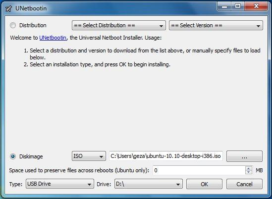
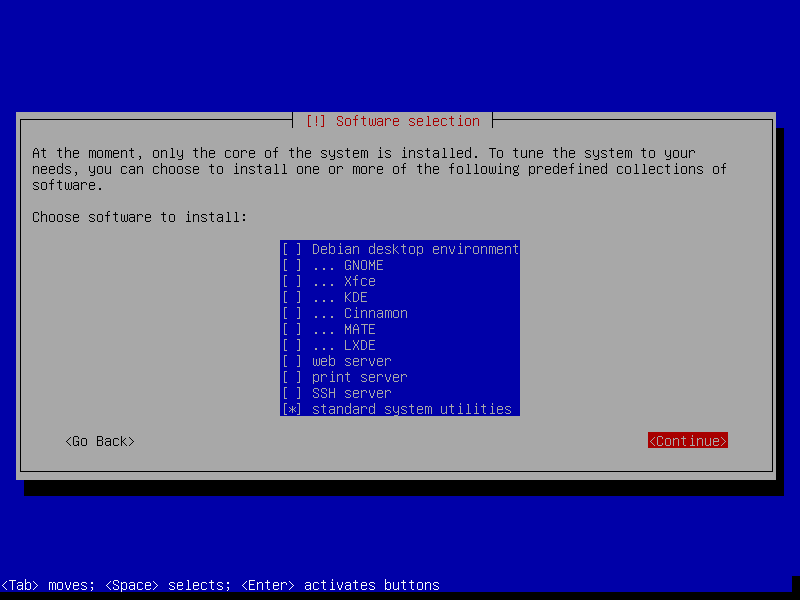
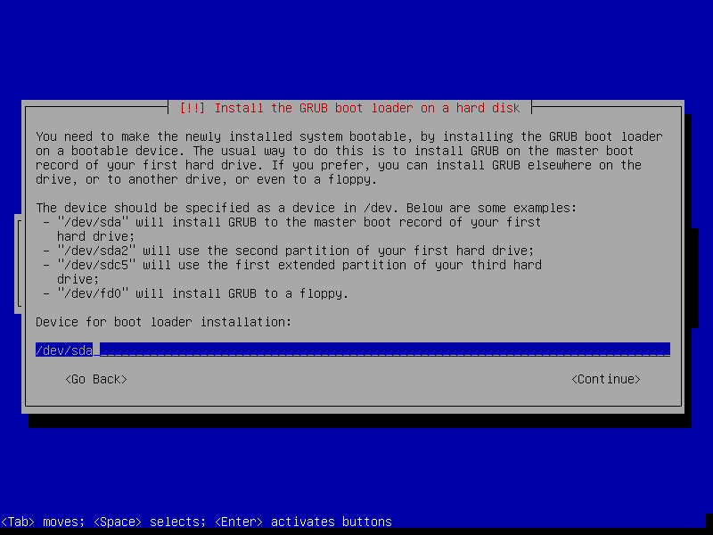
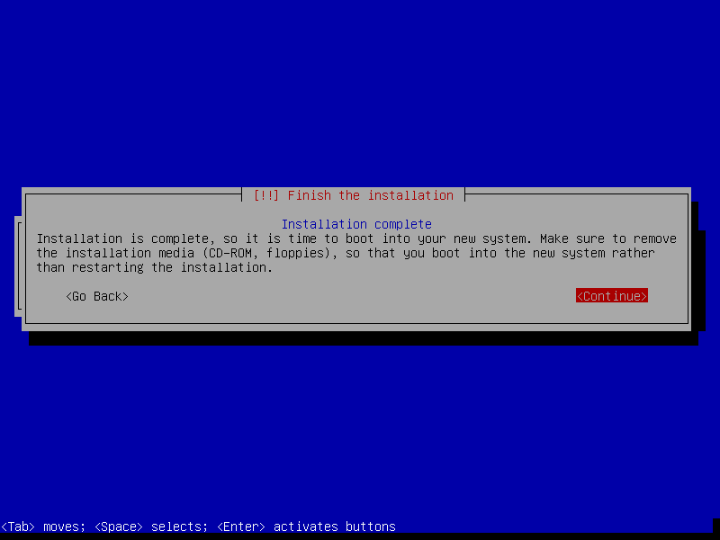
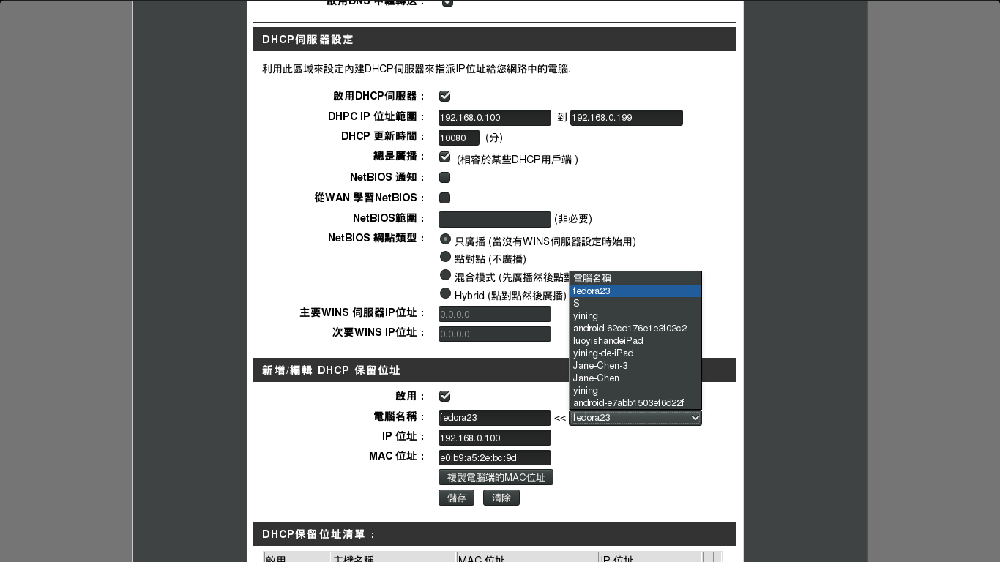
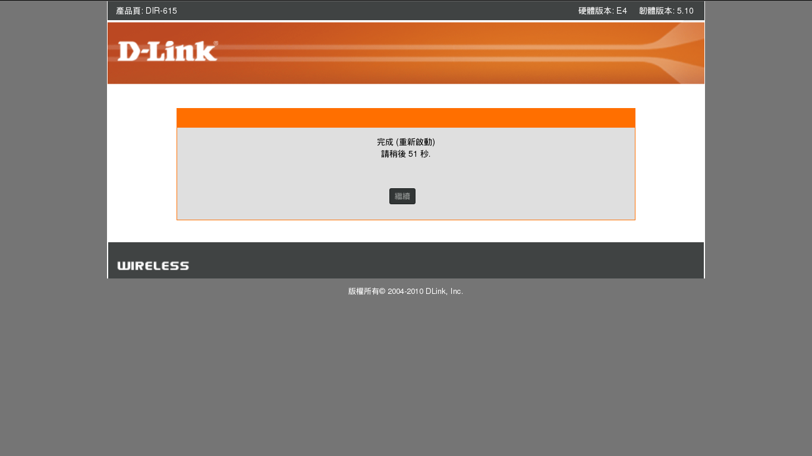

# Before the Installation
## Download Debian Image

Debian provides many options for installation.

- Download a [small installation image][small] if you have a machine with an Internet connection. 
- Download a [complete installation image][complete] if you want to install Debian without any Internet connection.
- Download a [live install image][live] if you want to test Debian before installing it.

For the convenience, we will download [DVD version: debian-8.2.0-amd64-DVD-1.iso][DVD] in this manual.

[small]: https://www.debian.org/distrib/netinst
[complete]: https://www.debian.org/CD/
[live]: https://www.debian.org/CD/live/
[CD01]: http://cdimage.debian.org/debian-cd/8.2.0/amd64/iso-dvd/debian-8.2.0-amd64-DVD-1.iso

## Prepare Device for Booting

After downloading the CD/DVD image, you need to write them directly to an USB stick or a CD/DVD.

### Create a bootable CD/DVD
Create a bootable CD/DVD is as easy as burning your favorite movie into your DVD. Almost all modern operation systems have som built-in disc burner. To create your own bootable device, follow the approaches below:

- For Windows: [built-in disc burner][windows-burn]
- For Mac OSX: [built-in method][osx-burn]
- For Linux: [built-in application in Gnome Desktop Environment][brasero-burn]

[windows-burn]: http://windows.microsoft.com/en-US/windows7/Burn-a-CD-or-DVD-from-an-ISO-file
[osx-burn]: https://support.apple.com/kb/PH19009?locale=en_US
[brasero-burn]: http://askubuntu.com/questions/136165/how-to-create-iso-images


Finally, your CD/DVD turns into a "bootable device".

### Create a bootable USB driver
If you do not have any blank CD at hand, you can use an USB stick as a bootable device.

1. Download [**UNetbootin**](https://unetbootin.github.io/).
2. Start UNetbootin and select the installation **diskimage** you've downloaded.
3. Select **Type** as **USB Drive**
4. Select **Drive** as where your USB stick mounted.
5. Click **OK**.



After the process completes, you will get a **reusable** bootable USB stick.

## Set the BIOS Booting Priority 
BIOS is a built-in firmware to perform hardware initialization during startup on PC. One of its main functions is to select which devices are potential bootable devices, and in which order booting from them will be attempted. Thus, you should configure your bootable device first for the boot priority. 

1. A modern BIOS setup utility can accessed by pressing a certain key on the keyboard when the PC starts. Usually the key is advertised for short time during the early startup, for example "**Press F2 for Setup Menu.**".


2. Then switch to **Boot** tab.


3. Select your bootable USB stick as **1st Boot Device**.


Once your computer restarts, it will boot using your new boot order priority.  

_**NOTE:** While different computers use different BIOS keys and have different BIOS layouts, the process is similar on most computers._

# Install Debian
## Install Debian Operation System
Here comes the most important part of this manual. Assumed you already booted your machine via the bootable device. You will enter the install welcome page, we will choose normal Install mode:


### Setup Location, Locales and Keyboard Layout
It is important to ensure your system time, keyboard layout is correct during the installation.  
In this manual, we choose:

- system language: English
- location: Other/Asia/Taiwan
- locale: en_US.UTF-8
- keyboard: American English


### Setup Hostname and Account
1. Enter the hostname for your server. (the domain name is often left blank)


2. **Leave blank** for the password of **root** user. (We use sudo user istead.)


3. Setup your sudo user's name and password.


### Thing about Partition
The design of partition table varies cases by cases. Assumed that you are going to setup a server for R computing.
You want to mix a **5 TB HDD** and a **1 GB SSD** for these two aims:  

- Speed up your system: as much commonly used data as possible stays on the SSD.
- Keep volatile data off the SSD to reduce wear.

A scheme would be like this:

- SSD: /boot, / (root), /usr
- HDD: /var, /home, /tmp, swap

The recommended size of the partitions:

- [/boot][/boot] : 200 - 500 MB 
  For store multiple kernels/boot images, around 350 MB of partition size is sufficient.
- [/ (root)][root] : > 20 GB
  Traditionally, **/ (root)** contains the [**/usr**][/usr] directory, which can grow significantly depending on how much softwares installed (softwares installed in /usr usually be shared among all users.)

- [/var][/var] : 8-15 GB 
  This partition may contain mails, cache, and other user programs and daemon. Seperate it from / (root) can reduce danger and wear of your SDD.
    
- [/tmp][/tmp]: > 2 GB
  This partition stored temporary files. For instance, your downloaded a Debian DVD image via Firefix with open option. It would download to **/tmp**. If you are going to do simulation with lots of temporary output files, you can save them inside **/tmp**. The recommanded size is not less 2 GB.

- [swap][swap] : [varies] 
  Swap area is so called virtual memory. The old general rule for swap partition size was to allocate twice the amount of physical RAM. If a sufficient amount of your physical RAM is available, it is possible to have a smaller partition size of swap area.

- [/home][/home] : [varies] 
  It is typically where user data, downloads, and multimedia reside. On a desktop system, **/home** is typically the largest filesystem on the drive.

[/boot]: https://en.wikipedia.org/wiki//boot
[root]: https://en.wikipedia.org/wiki/Root_directory
[/var]: http://www.tldp.org/LDP/Linux-Filesystem-Hierarchy/html/var.html
[/tmp]: https://en.wikipedia.org/wiki/Filesystem_Hierarchy_Standard
[swap]: https://wiki.debian.org/Swap
[/home]: https://en.wikipedia.org/wiki/Home_directory

Finally, your partition table would look like this:
```bash
  SCSI1 (0,0,0) (sda) - 1.0 GB VBOX VIRTUAL SSD
        #1 primary  500.0 MB  B  f  ext4  /boot
        #2 primary    5.0 GB     f  ext4  / 
        #5 logical  100.0 GB     f  ext4  /usr

  SCSI2 (1,0,0) (sdb) - 5.0 TB VBOX HARDDISK GPT
        #1 primary   30.0 GB     f  ext4  /var
        #2 primary  100.0 GB     f  swap  swap
        #3 primary   20.0 GB     f  ext4  /tmp
        #4 primary    4.0 TB     f  ext4  /home
        #5            0.7 TB        FREE SPACE
```

### Setup Partition 
1. Manual partition disks. Select which  disk to be parted.


2. Create new partition table. (Default: [MBR][MBR])  
  _**NOTE:** When your disk volume exceed 2 TB, you should choose [GPT][GPT] instead of default [MBR][MBR]_


3. Select Free Space to create new partition. 


4. Setup size, type and location of new partition. Should create **/boot** first for setting bootloader.


5. Turn on bootflag for **/boot** partition. Then write changes to disks.


[MBR]: https://en.wikipedia.org/wiki/Master_boot_record
[GPT]: https://en.wikipedia.org/wiki/GUID_Partition_Table

### Skip the Configuration of Package Manager
A well developed **Package Manager** can be the soul of a linux distribution, bring much convenience to download open-source software in minimum typing strokes. However, we will config our package manager later.
1. Skip scanning another CD/DVD and network installation.


2. Decide participate Debian survey or not. (We choose no.)


3. Select only **standard system utilties** to install.



### Install the GRUB Boot Loader into MBR

By default, the amd64 boot loader **"grub"** will be installed into the Master Boot Record ([MBR][MBR]), where it will take over complete control of the boot process.


1. Select **Enter device manually**.


2. Decide where to install GRUB boot loader. (Generally, it depends on where your **/boot** partition located. In this manual, you should input **/dev/sda/**.)



3. Finished the installation.



4. Congratulations! You've done the most difficult part of this manual. Let's startup the server.


## Configure the "APT" Package manager
### Check The Network Connection

Although you've succeed the installation, you cannot do anything without configuring your source of your **package manager**.

Most Debian-based systems provied a powerful package manager called **Advanced Packaging Tool**, or **APT**. We can easily use **apt-get** command to install/remove open-source software in the Debian repository.


Before starting the configuraion, check the network connection in advance:
```bash
test@server$ ping www.gooogle.com
```

If you receive something like, it mean your connection is well:
```bash
PING www.google.com (74.125.203.105) 56(84) bytes of data.
64 bytes from th-in-f105.1e100.net (74.125.203.105): icmp_seq=1 ttl=46 time=15.6 ms
64 bytes from th-in-f105.1e100.net (74.125.203.105): icmp_seq=2 ttl=46 time=15.4 ms
64 bytes from th-in-f105.1e100.net (74.125.203.105): icmp_seq=3 ttl=46 time=15.6 ms
```

### Setup Archive Mirror Repository to Your Server

- Open **/etc/apt/source.list**
We will use **vi** to edit **source.list**. If you are not familiar to **vi**, use **nano** to substitube for **vi** in the command.
```bash
test@server$ sudo vi /etc/apt/source.list
```

- For an archieve mirror of Debian 8 (jessie) repository, simply add following lines into **sourece.list**.
```bash
deb http://<favourite-debian-mirror>/debian/ jessie main
deb-src http://<favourite-debian-mirror>/debian/ jessie main
```
_**NOTE**: You need to substitute_ `<favourite-cran-mirror>` _by one of the mirror URLs listed in the [mirror list](https://www.debian.org/mirror/list)._
_For example:_ `deb http://debian.csie.ntu.edu.tw/debian/ jessie main`

- Comment out the sources from CD/DVD
In the **source.list** file, there are some CD/DVD sources reserved for dealing some situation without network in the future. For now, they are useless and should be commented out:  
```bash
# deb cdrom:[Debian GNU/Linux 8.2.0 _Jessie_ - Official amd64 CD Binary-1 20150906-11:13]/ jessie contrib main
# deb cdrom:[Debian GNU/Linux 8.2.0 _Jessie_ - Official amd64 CD Binary-1 20150906-11:13]/ jessie contrib main
```

After all the commands above, you can install whatever your want in the Debian Repository.

### Let's learn some useful apt-get command:

- **apt-get update**: This command can resynchronize and update all packages from the sources. For security issue, ensure you update your server regulariry.
- **apt-get install/remove**: These command can simply install/remove packages you specified.
- **apt-get auroremove**: After you remove some pakcages, you may want to execute this command for **clean all the dependency**.

## Optional: Install Graphical User Desktop Environment
If you are not comfortable with command line interface, you can download your favorite desktop environment such as Gnome or KDE from the Debian repository. Following are some commands to install them.

### Gnome Desktop Environment (GDM)
The [GNOME][gnome] Desktop Enviroment is an fantastic-looking, modern, and useful desktop environment. [GNOME][gnome] is both free and one of the most widely used desktop environments on the GNU/Linux operating system.  

To install it, first make sure that tasksel and aptitude are installed:
```bash
test@server$ sudo apt-get install aptitude tasksel
```

Then, install the GNOME task:
```bash
test@server$ sudo tasksel install gnome-desktop --new-install
```

### LXDE (Lightweight X11 Desktop Environment)
[LXDE][lxde] is a free desktop environment with comparatively low resource requirements. It is recommanded if you only need basic operation with graphical interface.   
To install a complete Debian [LXDE][lxde] desktop environment, execute commands below:
```bash
test@server$ sudo apt-get update
test@server$ sudo apt-get install task-lxde-desktop
```

### Start X-session
After the installation, you can simply enter the desktop environment by execute the command:
```bash
test@server$ startx
```

_**NOTE:** Click [here][dm-guide] for more desktop environment installation guide._

[gnome]: https://www.gnome.org/
[lxde]: http://lxde.org/
[dm-guide]: https://wiki.debian.org/DesktopEnvironment

# Softwares Installation and Other Configuration
## Useful Softwares and Services
Before starting any simulations or programming, you need to install the following software:

- [Vim][vim]: Powerful text editor.
- [R][r]: An open source, multi-platfrom language and environment for statistical computing and graphics.   
- [openssh][openssh]: Premier connectivity tool for remote login with the SSH protocol.
- [Rstudio Server][rstudio]: Productive user interface for R. Also free, open-source, and cross-paltform.
- [MariaDB][mariadb]: A popular database servers. Made by the original developers of MySQL.

While any package would have been tested thoroughly before included in a Debian stable release, the latest version of R and other packages won't be included in the repository. Hence, you need to add some additional repositories manually.

The following steps are all done in command line (or terminal emulator).

[vim]: www.vim.org
[r]: https://www.r-project.org/
[rstudio]: https://www.rstudio.com/
[openssh]: http://www.openssh.com/
[mariadb]: https://mariadb.org/

## Vim
```bash
test@server$ sudo apt-get update
test@server$ sudo apt-get install vim
```

## R
For downloading latest version of R, adding additional repositories to debian repository list is required.

- For a backport of latest R to Debian 8 (jessie), simply open **/etc/apt/sourece.list**.
```bash
test@server$ sudo vim /etc/apt/source.list
```

- Then add following lines into **/etc/apt/sourece.list**.
```bash
deb http://<favourite-cran-mirror>/bin/linux/debian jessie-cran3/
deb-src http://<favourite-cran-mirror>/bin/linux/debian jessie-cran3/
```
_**NOTE**: You need to substitute_ `<favourite-cran-mirror>` _by one of the mirror URLs listed in the [mirror list](http://cran.r-project.org/mirrors.html)._   
_For example:_ `deb http://cran.csie.ntu.edu.tw/bin/linux/debian jessie-cran3/`.

- Fetch and import Debian backports archives on CRAN (CRAN Debian archive) with key ID 381BA480.
```bash
test@server$ sudo apt-key adv --keyserver keys.gnupg.net --recv-key 381BA480
```

- Finally, install R.
```bash
test@server$ sudo apt-get update
test@server$ sudo apt-get install r-base r-base-dev
```

- After the installation, execute this command to check the version of R in your server is up-to-date.
```bash
test@server$ R --version
```

## OpenSSH
### Installation

Normally the client and server are installed by default. If not it suffices to run:
```bash
test@server$ sudo apt-get update
test@server$ sudo apt-get install openssh-client openssh-server
```

### Simple Configuration

The main configuration files are in the directory **/etc/ssh**:

**ssh_config** : client configuration file
**sshd_config** : server configuration file 

We will only cover the server configuration in this manual.

- Open **/ect/ssh/sshd_config** for editing.
```bash
test@server$ sudo vim /etc/ssh/sshd_config
```

- For security, change the listening port instead of default TCP port 22 as such:
```bash
Port 10022
```

- Ensure that **PermitRootLogin** is set to **no** in sshd_config (we use sudo-user only):
```bash
PermitRootLogin no
```

- Start your SSH service.
```bash
test@server$ sudo /etc/init.d/ssh start
```


_**NOTE:** After any configuration, always restart server to apply your changes._
```bash
test@server$ sudo /etc/init.d/ssh restart
```


## Rstudio Server
RStudio: a integrated development environment (IDE) for R. Also free, open source and multi-platform.
To start/stop/restart Rstudio server, use followings commands:

### Installation
To download and install RStudio Server. Execute the following commands. Note that **gdebi** should be installed first.
```bash
test@server$ sudo apt-get update
test@server$ sudo apt-get install gdebi-core
test@server$ wget https://download2.rstudio.org/rstudio-server-0.99.491-amd64.deb
test@server$ sudo gdebi rstudio-server-0.99.491-amd64.deb
```

To verify your installation, excute following command:
```bash
test@server$ sudo rstudio-server verify-installation
```

### Simple Configuration
Simple commands for start/stop/restart server
```bash
test@server$ sudo rstudio-server stop
test@server$ sudo rstudio-server start
test@server$ sudo rstudio-server restart
```

The default port for Rstudio server is **8787**. That means any can connect to the server through the URL **http://<server-ip/hostname>:8787**.  
If you wish to change to another port, you should add following configuration into **/etc/rstudio/rserver.conf** file. For example:
```bash
www-port=18787
```

Note that after any configuration, always restart server to apply your changes. 
```bash
test@server$ sudo rstudio-server restart
```

Other tips:
- The users in Rstudio server are references to users of system.
- Each user needs to be created with a home directory.
- More tips on [Rstudio server support](https://support.rstudio.com/hc/en-us/sections/200150693-RStudio-Server).

## MariaDB
MariaDB is one of the most popular database server in the world. Being a community-developed fork of MySQL RDBMS, MariaDB intended to remain free under the GNU GPL license.
To start/stop/restart MariaDB server, please read more:

### Installation
First download MariaDB client and server
```bash
test@server$ sudo apt-get update
test@server$ sudo apt-get install mariadb-client mariadb-server
```

Then, set the password for root.


Finally, start MariaDB server
```bash
test@server$ sudo /etc/init.d/mysql start
```

### Simple Configuration
Simple commands for start/stop/restart server:
```bash
test@server$ sudo rstudio-server stop
test@server$ sudo rstudio-server start
test@server$ sudo rstudio-server restart
```

Mariadb setup initial databse in /var/lib/mysql by default. 
If you want to manually configure your installation, go to the secure installation:
```bash
test@server$ sudo mysql_secure_installation
```

If you have set a strong password, skip the first step.
```bash
NOTE: RUNNING ALL PARTS OF THIS SCRIPT IS RECOMMENDED FOR ALL MariaDB
      SERVERS IN PRODUCTION USE!  PLEASE READ EACH STEP CAREFULLY!

In order to log into MariaDB to secure it, we'll need the current
password for the root user.  If you've just installed MariaDB, and
you haven't set the root password yet, the password will be blank,
so you should just press enter here.

Enter current password for root (enter for none):


OK, successfully used password, moving on...

Setting the root password ensures that nobody can log into the MariaDB
root user without the proper authorisation.

You already have a root password set, so you can safely answer 'n'.

Change the root password? [Y/n]
```

Recommand to **remove anomyous users** for security.
```bash
By default, a MariaDB installation has an anonymous user, allowing anyone
to log into MariaDB without having to have a user account created for
them.  This is intended only for testing, and to make the installation
go a bit smoother.  You should remove them before moving into a
production environment.

Remove anonymous users? [Y/n]
```

For security issue, do not allow remote login for root.
```bash
Normally, root should only be allowed to connect from 'localhost'.  This
ensures that someone cannot guess at the root password from the network.

Disallow root login remotely? [Y/n]
```

Removing or not is all your choices.
```bash
By default, MariaDB comes with a database named 'test' that anyone can
access.  This is also intended only for testing, and should be removed
before moving into a production environment.

Remove test database and access to it? [Y/n]
```

Finally, flush all changes now.
```bash
Reloading the privilege tables will ensure that all changes made so far
will take effect immediately.

Reload privilege tables now? [Y/n]
```

### Change MariaDB Data Directory and Other Configurations
MariaDB save all databases in `/var/lib/mysql/` by default. If you aim to store Terabytes of data, your `/var` partition might get full.
To avoid this, you can modifiy some MariaDB variables.

First, stop MariaDB service.
```bash
test@server$ sudo service mysql start 
```

Copy the existing data directory. Note that 
```bash
test@server$ sudo cp -R -p /var/lib/mysql /newpath/by/your-choice
```

Edit the MariaDB configuration file
```bash
test@server$ sudo vim /etc/mysql/my.cnf
```

Look for the entry for **datadir** (usually under **[mysqld]**). Change the path (default: **/var/lib/mysql**) to your new data directory.
```bahs
[mysqld]
...
...
other config
...

datadir = /newpath/by/your-choice
```

Restart MariaDB server.
```
test@server$ sudo service mysql start
```

In addition, you can also change port for client under **[client]** group configuration. Default: 3306
```bash
[client]
port = 13306
```

### Simple account management
MariaDB provide a command line tool. To enter your database on localhost, you must explicit input **user** and **password**.
```bash
test@server$ mysql -u root -p
```

If you succeed, you would see this:
```bash
MariaDB [(none)]> 
```

To create a super user that can remotely login, follow the commands in MariaDB shell:
```
MariaDB [(none)]> CREATE USER your_super_user@'%' IDENTIFIED BY 'your-Pa$$w0rD';
```

Then give all usage to the super user on all database (include create/drop other users)
```
MariaDB [(none)]> GRANT ALL PRIVILEGES ON *.* TO your_super_user@'%' with grant option; 
```

For more management of accounts and usages. Please read the [official documentation][grant].
[grant]: https://mariadb.com/kb/en/mariadb/grant/

### Database Management GUI Tools
Using GUI tools for daily database management will save your live from works.
Here are some recommandation:

[MySQL Workbench][workbench]: MySQL Official GUI Tools. Provides many advanced functions.  
[phpMyAdmin][phpmyadmin]: A Web interface tool written in PHP. Can I/O data to various formats (CSV, XML...).  
[HeidiSQL][heidisql]: A lightweith tool for database management. Has protable version. *Windows only*.  
[SQLyog Community Edition][sqlyog]: Community edition of SQLyog MySQL administration tool.  

[workbench]: http://www.mysql.com/products/workbench/
[phpmyadmin]: https://www.phpmyadmin.net/
[heidisql]: http://www.heidisql.com/
[sqlyog]: https://github.com/webyog/sqlyog-community/wiki/Downloads


### Database Interface for Other Language
Mariadb is under GPL license. Some other language need a less strict license version to connect to MariaDB server. 
Hence, install LGPL version library of client-side.
```bash
test@server$ sudo apt-get update
test@server$ sudo apt-get install libmariadb-client-lgpl-dev
```

With this library, you can user almost all SQL-like commands via popular languages such as R:
```r
if (!require(RMySQL)) install.package("RMySQL")
# Connect to a database
conn <- dbConnect(MySQL(), dbname = "test")
print(conn)
```

```
## <MySQLConnect:0,0>
```

Write data.frame into database. Then read it.
```r
dbWriteTable(conn, name = "mtcars", value = datasets::mtcars)

test_mtcars <- dbReadTable(conn, "mtcars")
dim(test_mtcars)
```

```
## [1] 32 11
```

SQL query statement
```r
res <- dbSendQuery(conn, "SELECT * FROM mtcars")
dbFetch(res, n = 3)
```

```
##       row_names  mpg cyl disp  hp drat    wt  qsec vs am gear carb
## 1     Mazda RX4 21.0   6  160 110 3.90 2.620 16.46  0  1    4    4
## 2 Mazda RX4 Wag 21.0   6  160 110 3.90 2.875 17.02  0  1    4    4
## 3    Datsun 710 22.8   4  108  93 3.85 2.320 18.61  1  1    4    1
```

```r
dbClearResult(res) # Clear the unused query results.
```

Remove table and disconnect 
```r
dbRemoveTable(conn, "mtcars")
dbDisconnect(conn)
```


## Additional: Port Forwarding / Port Mapping
To forward ports, you first need to understand about what your router does.

Your router has a function called **Network Address Translation**, or **NAT**, built-in. Inside your network, computers get their own addresses like **192.168.1.100**. These addresses are called ["private"][private] or ["reserved"][reserved] addresses which automatically assigned by your home router via [DHCP][DHCP]. A computers can communicate with router and with each other via its own address.

However, these **"private" addresses** could only be recognized within private network. It will be failed if others want to connect to a specific computer via an address like **192.163.1.100**. Therefore, we should change it from the private IP of the computer to the public IP of the router. This is so called the [port forwarding][port_forwarding].

[private]: http://en.wikipedia.org/wiki/Reserved_IP_addresses
[reserved]: http://en.wikipedia.org/wiki/Private_IP_addresses#Private_IPv4_address_spaces
[DHCP]: http://en.wikipedia.org/wiki/DHCP
[port_forwarding]: https://en.wikipedia.org/wiki/Port_forwarding

### Configure Port Forwarding on a Router
Configuration of port forwarding often varies from routers to routers. In this munual, we would use **D-Link** for demonstration.

1. Use your favorite browser to visit **"192.168.0.1"** to connect to your D-Link router.


2. Select **Network Setting** at the sidebar. Then scroll to **Add New DHCP Reservation**.


3. Add a new **DHCP reservation** for your server's IP. Remember to save your configuration.



4. Wait for seconds. Then Select **Advance Setting** at the top bar. Select **Virtual Server** at the siderbar.



5. Add virtual server.
    a. Add a new application named **SSH**. Set **Public port** at what you set in **sshd_config**. (We use 10022 for demo.)   
    _**NOTE:** Your can also set a port for private network_
    b. Select the **machine/server** your want to forward the port. (Or just type its **private IP**)  
    _**NOTE:** Remember to save your changes_  


_**NOTE:** Connecting to your Rstudio server via TCP/IP is exactly the same thing as connecting to your SSH server. The only thing need to change is the port you forwarding. (Default port of Rstudio server is 8787.)_
