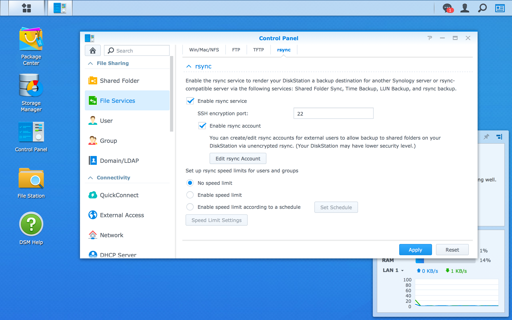
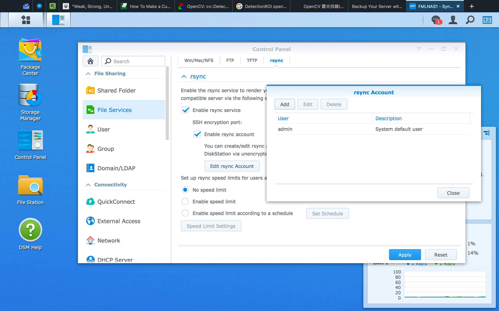

## Setting rsync daemon

We already leared about the powerful rsync for transferring files. Now, we will implement rsync on a Network-attached Storage (NAS). Assumed we have two server2 and one NAS. All these devices is connected with each other via [local area network][LAN] (LAN). 

The port mapping is as following:

- server1: 192.168.0.1
- server2: 192.168.0.2
- myNAS:  192.168.0.3

And we have two different to backup files from servers seperately. (though volumes can be the same partition technically)

- server1 /home/ -----> sync to NAS /volumes/server1
- server2 /home/important -----> sync to NAS /volumes/server2/important
 
[LAN]: https://en.wikipedia.org/wiki/Local_area_network 

### 0. What is NAS?
[NAS][nas] is just an self-contained, file-level storage server connected to a network. It is actually a tiny computer that powered with some abilities to store and aceess files more elegantly. In this manual, we would use the **Synology**'s NAS for example.

Before we start, you must setup all the volume, RAID, and other stuff in your NAS. Synology's product have a decent web-base operating system called DiskStation Manager (DSM). You can read their [documents][document] to get started.

[nas]: https://en.wikipedia.org/wiki/Network-attached_storage
[document]: https://www.synology.com/en-global/knowledgebase/DSM/help/DSM/MainMenu/get_started


### 1. Enable rsync daemon via operating system of your NAS

First, login DSM. Open the **Control Panel**, then select **File Services**.


Check the **Enable rsync service** field.



Then, add your super user as a rsync account to enable rsync daemon access.



### 2. Write your own `rsyncd.conf`

After previous steps, NAS start rsyncd daemon automatically for you. The rest you have to do is specify different setting between servers. 

While we enable rsync in NAS DSM, we also enable ssh via TCP port 22 by default. However, the ssh service on NAS system is only for local network usage. We would keep it in LAN. No port forwardgin to WAN.

Thus, if we want to ssh-login NAS system, we need to use either a device in the same LAN.
```bash
# Login in NAS system via **server1**
user@server1$ ssh user@192.168.0.3

...

# Logged in NAS
user@myNAS$
```

Next, open the rsync configure file `/etc/rsyncd.conf`.
```bash
user@myNAS$ sudo vim /etc/rsyncd.conf
```

Here are a example `rsyncd.conf` file:
```
#---------------------------------------
# global parameters
#---------------------------------------

#motd file = /etc/rsyncd.motd
log file = /var/log/rsyncd.log          # file storing logs
pid file = /var/run/rsyncd.pid          # file recording their process ID
lock file = /var/run/rsync.lock         # file to ensure separation of two instance of a program

auth users = user, root                 # local users that can connect to a rsync daemon
uid = root                              # ID of the user that executes rsync daemon
gid = root                              # group Id of the user's group executing rsync daemon
use chroot = no                         # if true, will *chroot* to the path. Need root privilege
charset = utf-8                         # UTF-8 character set
list = yes                              # would list modules when the client asking
read only = no                          # default is read only, should be *no* for write files
reverse lookup = no                     # *no* for save time
secrets file = /etc/rsyncd.secrets      # contains *username:password* pattern for authentication
dont compress = *.gz *.tgz *.zip *.z *.rpm *.deb *.iso *.bz2 *.tbz *.RData
                                        # dont compress these files

#---------------------------------------
# module parameters
#---------------------------------------

[server1]                               # This is the **MODULE** name
comment = Back Up Module for server1    # would display while client ask the module list
path = /volume1/server1                 # the path to backup in the daemon's filesystem 
hosts allow = 192.168.11.102            # host allow to connect. We allow only LAN-side IP for security issue

[server2-important]
comment = Back Up Module for server2 important files
path = /volumes/server2
hosts allow = 192.168.11.103            # a module a host to avoid accidentally sync the wrong remote
```

After finishing configure `rsyncd.conf`, you should create secrets file at the path you specified. Assumed you set the path at `/etc/rsyncd.secrets`. Open it.

```bash
user@myNAS$ sudo vim /etc/rsyncd.secrets
```

Then follow the `username:password` pattern for the authentication. **_For security issue_, try to avoid using the same password as the server account.**
```
user:mypassword
root:rootHasItsOwnPassword
```

And the **important** part. You should use `chmod` to change access for the secrets file, otherwise rsyncd wont be able to work.
```bash
# only file owner can read/write the file
user@myNAS$ sudo chmod 600 /etc/rsyncd.secrets
```

At last, check there isn't any process running. Then reboot you NAS (Maybe there is another way to restart rsync daemon, but I have no idea with Synology DSM.)
