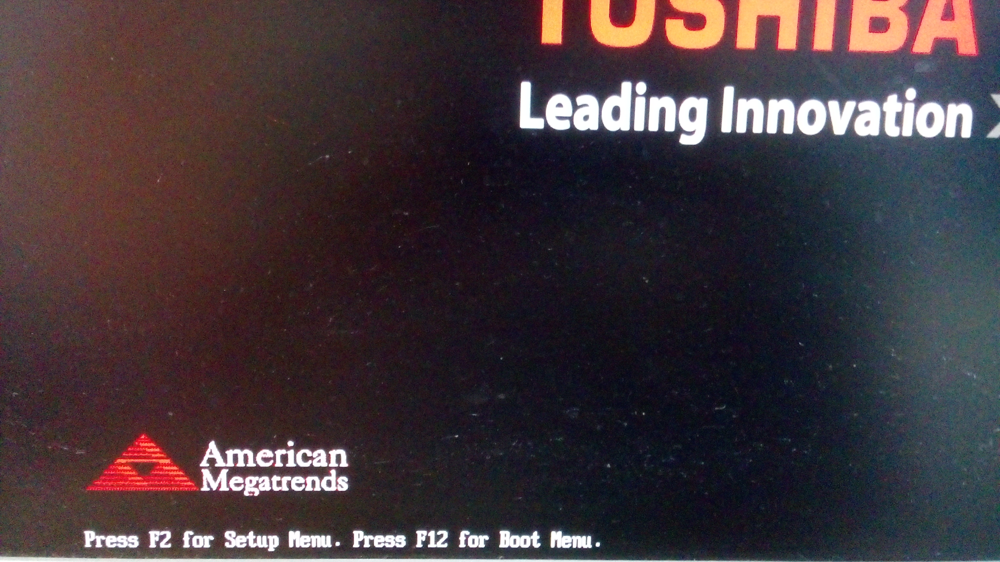

# Before the Installation
## Download Debian Image

Debian provides many options for installation.

- Download a [small installation image][small] if you have a machine with an Internet connection. 
- Download a [complete installation image][complete] if you want to install Debian without any Internet connection.
- Download a [live install image][live] if you want to test Debian before installing it.

For the convenience, we will download [DVD version: debian-8.2.0-amd64-DVD-1.iso][DVD] in this manual.

[small]: https://www.debian.org/distrib/netinst
[complete]: https://www.debian.org/CD/
[live]: https://www.debian.org/CD/live/
[CD01]: http://cdimage.debian.org/debian-cd/8.2.0/amd64/iso-dvd/debian-8.2.0-amd64-DVD-1.iso

## Prepare Device for Booting

After downloading the CD/DVD image, you need to write them directly to an USB stick or a CD/DVD.

### Create a bootable CD/DVD
Create a bootable CD/DVD is as easy as burning your favorite movie into your DVD. Almost all modern operation systems have som built-in disc burner. To create your own bootable device, follow the approaches below:

- For Windows: [built-in disc burner][windows-burn]
- For Mac OSX: [built-in method][osx-burn]
- For Linux: [built-in application in Gnome Desktop Environment][brasero-burn]

[windows-burn]: http://windows.microsoft.com/en-US/windows7/Burn-a-CD-or-DVD-from-an-ISO-file
[osx-burn]: https://support.apple.com/kb/PH19009?locale=en_US
[brasero-burn]: http://askubuntu.com/questions/136165/how-to-create-iso-images

Finally, your CD/DVD turns into a "bootable device".

### Create a bootable USB driver
If you do not have any blank CD at hand, you can use an USB stick as a bootable device.

1.  Download [**UNetbootin**](https://unetbootin.github.io/).
2.  Start UNetbootin and select the installation **diskimage** you've downloaded.
3.  Select **Type** as **USB Drive**
4.  Select **Drive** as where your USB stick mounted.
5.  Click **OK**.

After the process completes, you will get a **reusable** bootable USB stick.

## Set the BIOS Booting Priority 
BIOS is a built-in firmware to perform hardware initialization during startup on PC. One of its main functions is to select which devices are potential bootable devices, and in which order booting from them will be attempted. Thus, you should configure your bootable device first for the boot priority. 

-   A modern BIOS setup utility can accessed by pressing a certain key on the keyboard when the PC starts. Usually the key is advertised for short time during the early startup, for example "**Press F2 for Setup Menu.**".

-   Then switch to **Boot** tab.

-   Select your bootable USB stick as **1st Boot Device**.

Once your computer restarts, it will boot using your new boot order priority.  

_**NOTE:** While different computers use different BIOS keys and have different BIOS layouts, the process is similar on most computers._
