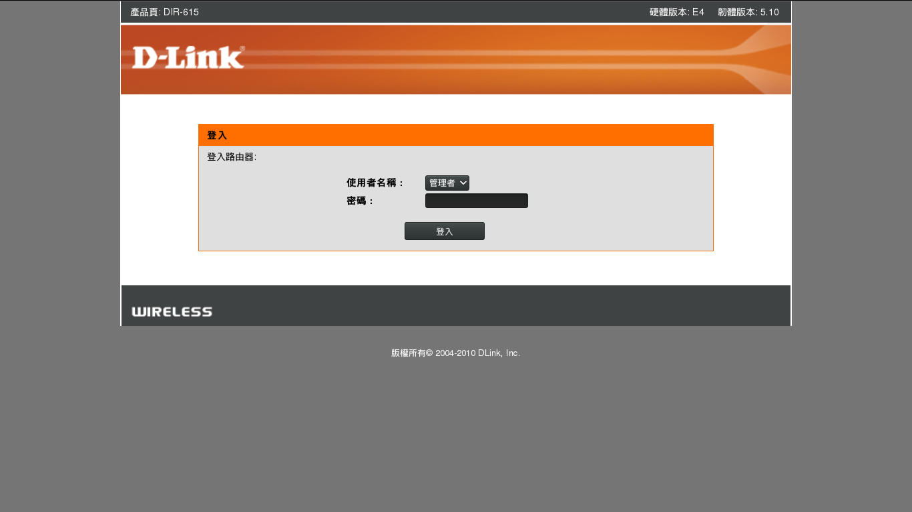
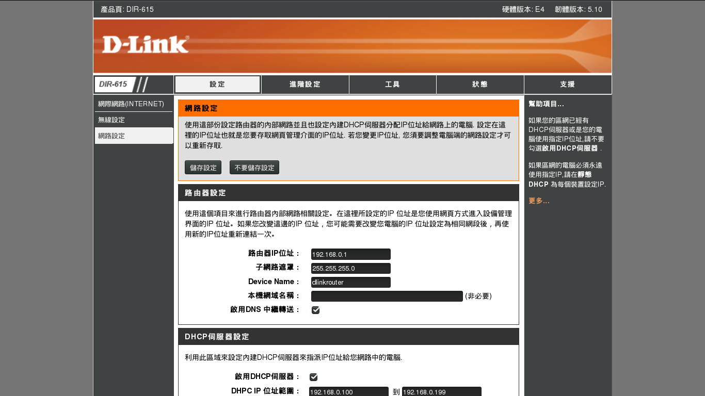
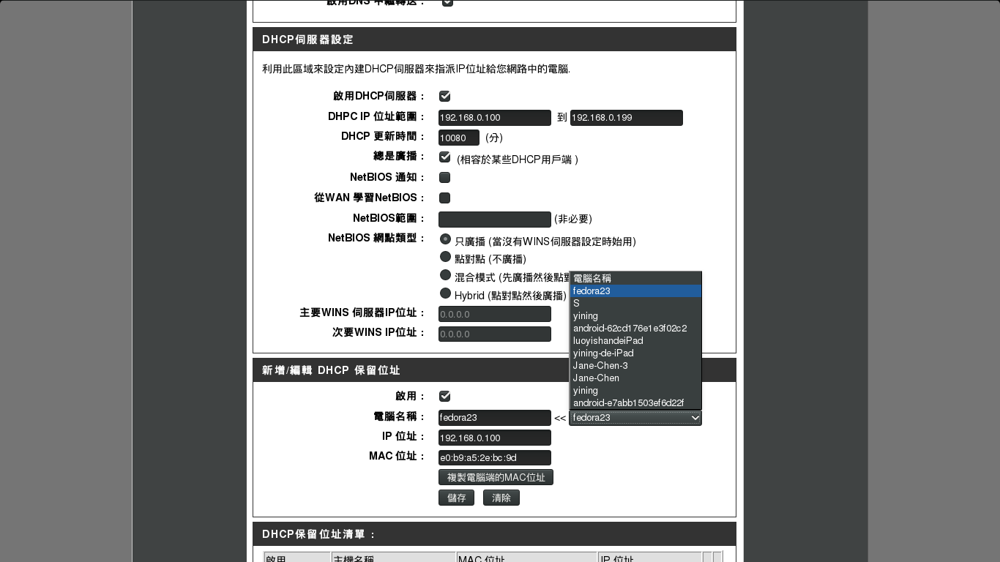
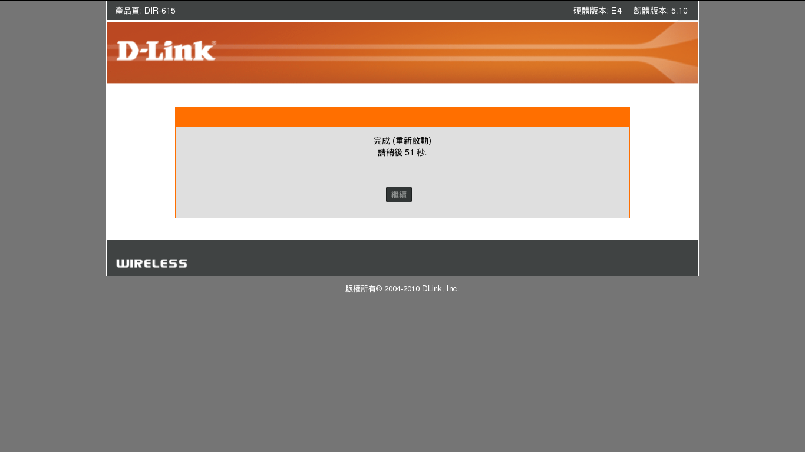
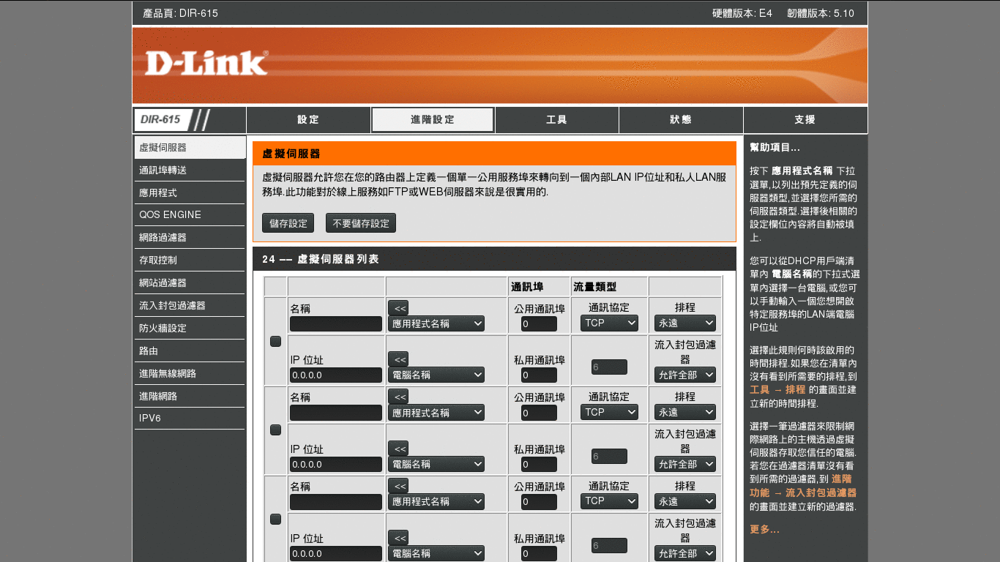

## Other Configuration

### Configure Port Forwarding on a Router
To forward ports, you first need to understand about what your router does.

Your router has a function called **Network Address Translation**, or **NAT**, built-in. Inside your network, computers get their own addresses like **192.168.1.100**. These addresses are called ["private"][private] or ["reserved"][reserved] addresses which automatically assigned by your home router via [DHCP][DHCP]. A computers can communicate with router and with each other via its own address.

However, these **"private" addresses** could only be recognized within private network. It will be failed if others want to connect to a specific computer via an address like **192.163.1.100**. Therefore, we should change it from the private IP of the computer to the public IP of the router. This is so called the [port forwarding][port_forwarding].

[private]: http://en.wikipedia.org/wiki/Reserved_IP_addresses
[reserved]: http://en.wikipedia.org/wiki/Private_IP_addresses#Private_IPv4_address_spaces
[DHCP]: http://en.wikipedia.org/wiki/DHCP
[port_forwarding]: https://en.wikipedia.org/wiki/Port_forwarding

Configuration of port forwarding often varies from routers to routers. In this munual, we would use **D-Link** for demonstration.

-   Use your favorite browser to visit **"192.168.0.1"** to connect to your D-Link router.

-   Select **Network Setting** at the sidebar. Then scroll to **Add New DHCP Reservation**.

-   Add a new **DHCP reservation** for your server's IP. Remember to save your configuration.

-   Wait for seconds. Then Select **Advance Setting** at the top bar. Select **Virtual Server** at the siderbar.

-   Add virtual server.  
    1. Add a new application named **SSH**. Set **Public port** at what you set in **sshd_config**. (We use 10022 for demo.)    
    _**NOTE:** Your can also set a port for private network_  

    2.  Select the **machine/server** your want to forward the port. (Or just type its **private IP**)   
    _**NOTE:** Remember to save your changes_  

_**NOTE:** Connecting to your Rstudio server via TCP/IP is exactly the same thing as connecting to your SSH server. The only thing need to change is the port you forwarding. (Default port of Rstudio server is 8787.)_
