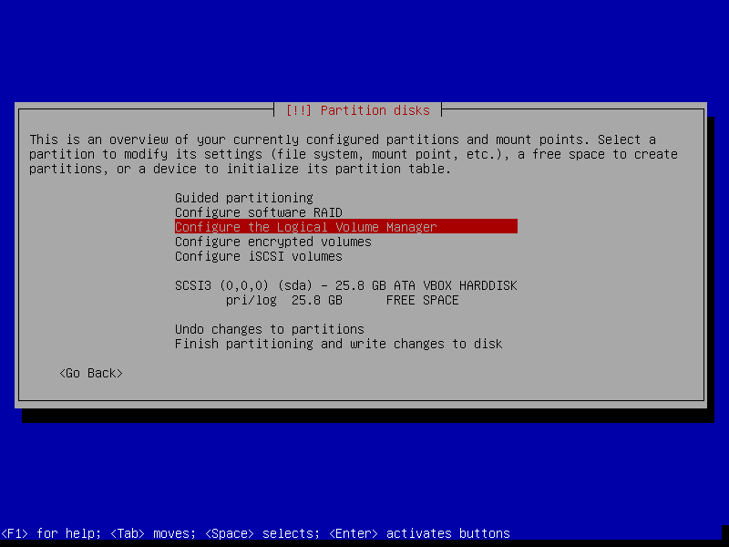
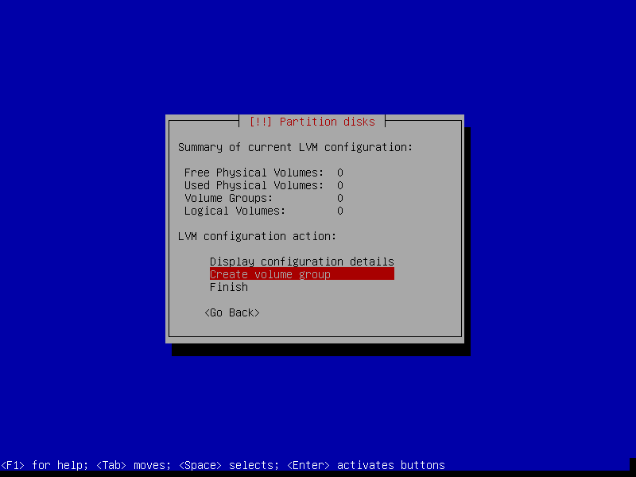
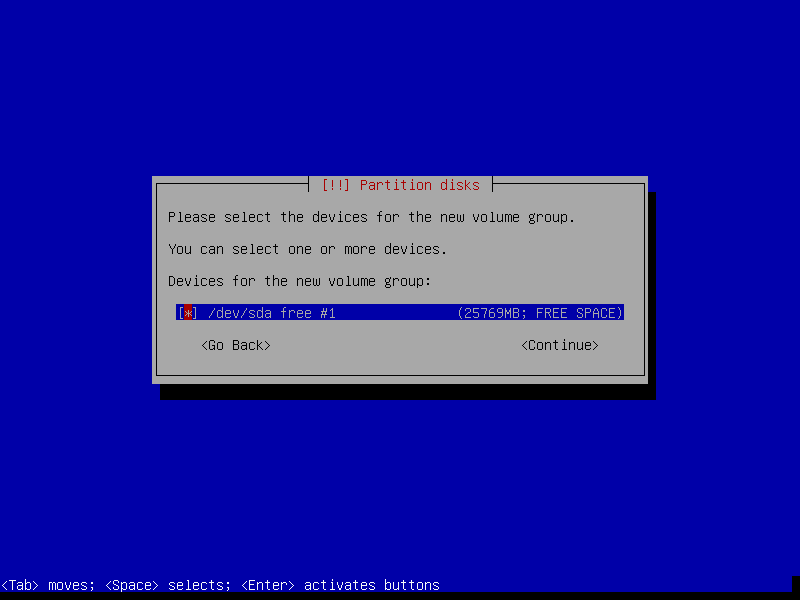
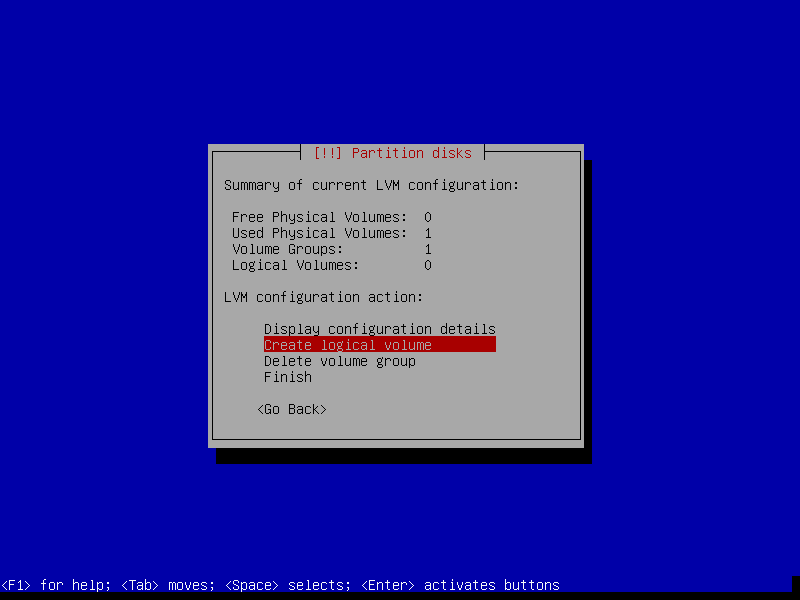
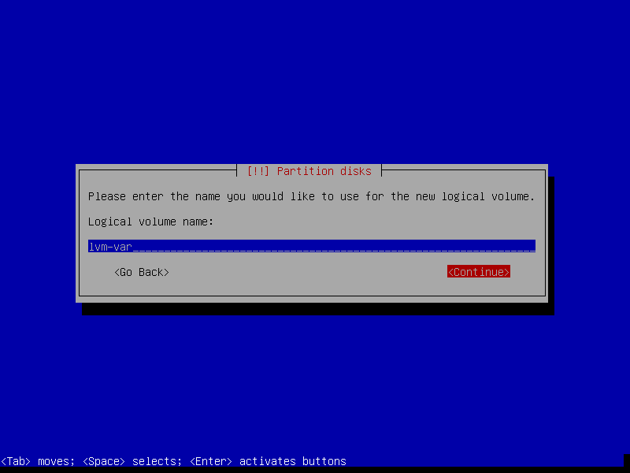
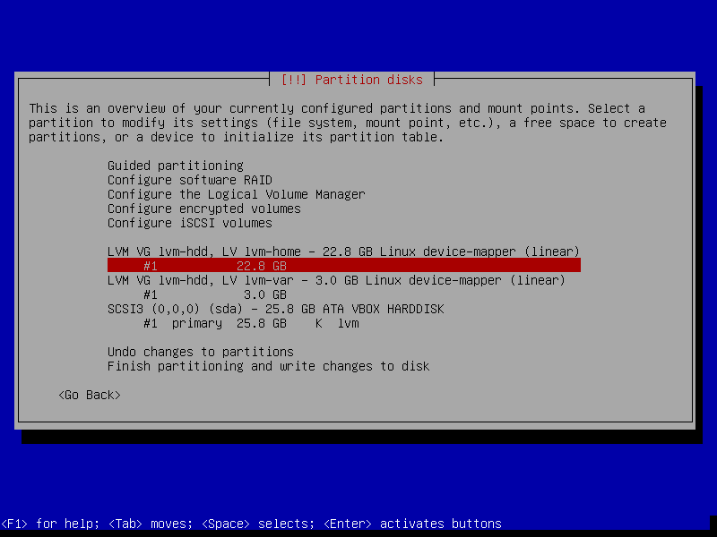

## Use LVM for Partition
[Logical Volume Manager (LVM)][lvm2] provides a more advanced and flexible 
method to manage logical volumes or filesystems on Linux kernel. Many 
operations such as resizing, moving, combining partition could be done at will,
even while the system is running.  

Most Linux distribution can done LVM while installation. This manual will 
demonstrate basic usage of LVM.

[lvm2]:http://www.sourceware.org/lvm2/

### Some Concepts of LVM
Before implementation, you should know some basic definitions:  

-   PV : Hard disk partitions. Stands for "physical volume".  
-   VG : For "volume groups". A collection of PVs. Can combine multiple device 
    to a VG as a single device.
-   LV : A virtual partition that under a VG. Stands for "logical volume".  

Simple steps for LVM:  

1.  Create a VG for combining usage.  
2.  Add PVs to existing VG. (may need to declare some physical partition to PV 
    if using command line tool fo LVM)
3.  Create some LVs in a VG.  
4.  You can use LVs as traditional partitions. Format them now!  


Here is a example look from [Debian Wiki][debian-lvm] for LVM:  

```
||-------------------------------OS---------------------------------||
||-Non-LVM-||-------------------------LVM---------------------------||
||  /boot  ||   LV-1 (/)  | LV-2 (swap)|  LV 3 (/home) | LV-4 (/tmp)|| Logical Volumes(LV)
||         ||------------------------------------------|------------||
||         ||                  VG 1                    |    VG 2    || Volume Groups(VG)
||         ||------------------------------------------|------------||
||/dev/sda1|| /dev/sda2 |     /dev/sda3    | /dev/sdb2 | /dev/sdd4  || Physical Volumes(PV)
||---------||-------------------------------------------------------||
```

_**NOTE:** Grub are not compatible with LVM, so /boot should not be inside the LVM partition._

### Use LVM while Debian installation
Using LVM while installation is really easy. Just choose **Configure the 
Logical Volume Manager**  



Create a volume group and name it.



Select some devices for the new volume group, then write changes on the device.



Create a new logical volume in your volume group.



Name your new logical volume. Configure its size. Write all changes.



You can use all logical volumes as tradtional partition at will!



### Command Line Tool of LVM
To use LVM after installation. You may need to download the command line tool.

```bash
test@server$ sudo apt-get update
test@server$ sudo apt-get install lvm2
```

For more infomation, please check [Debian Wiki for LVM][debian-lvm].

[debian-lvm]: https://wiki.debian.org/LVM
