## Install Debian Operation System
Here comes the most important part of this manual. Assumed you already booted your machine via the bootable device. You will enter the install welcome page, we will choose normal Install mode:

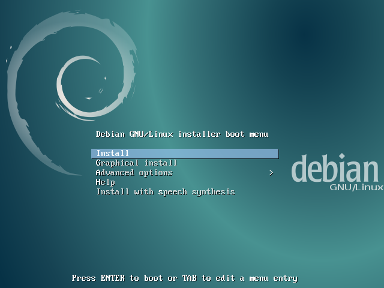

### Setup Location, Locales and Keyboard Layout
It is important to ensure your system time, keyboard layout is correct during the installation.  
In this manual, we choose:

-   system language: English
-   location: Other/Asia/Taiwan
-   locale: en_US.UTF-8
-   keyboard: American English

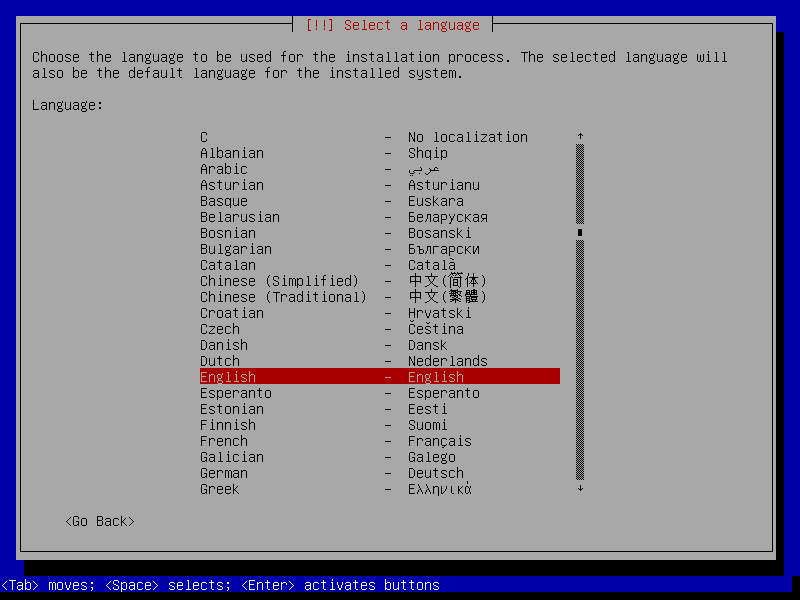

### Setup Hostname and Account
-   Enter the hostname for your server. (the domain name is often left blank)

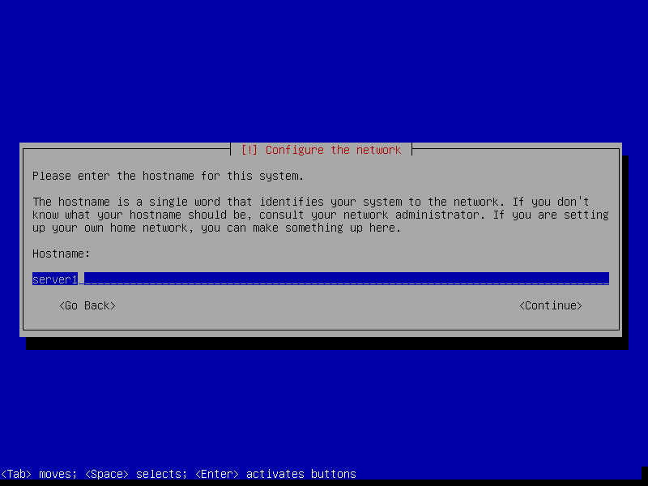

-   **Leave blank** for the password of **root** user. (We use sudo user istead.)

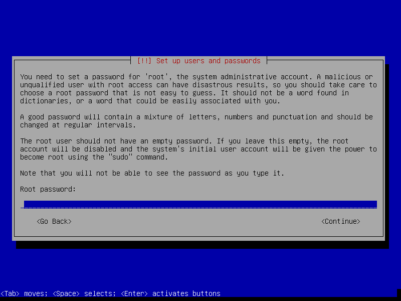

-   Setup your sudo user's name and password.

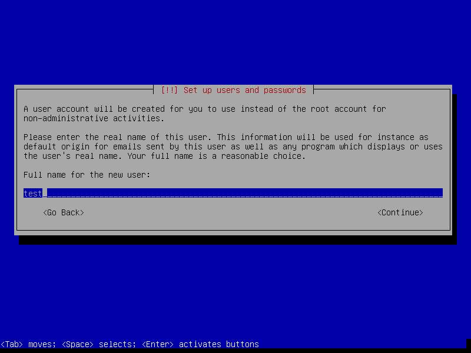

### Thing about Partition
The design of partition table varies cases by cases. Assumed that you are going to setup a server for R computing.
You want to mix a **5 TB HDD** and a **1 GB SSD** for these two aims:  

-   Speed up your system: as much commonly used data as possible stays on the SSD.
-   Keep volatile data off the SSD to reduce wear.

A scheme would be like this:

-   SSD: /boot, / (root), /usr
-   HDD: /var, /home, /tmp, swap

The recommended size of the partitions:

-   [/boot][/boot] : 200 - 500 MB 
    For store multiple kernels/boot images, around 350 MB of partition size is sufficient.
-   [/ (root)][root] : > 20 GB
    Traditionally, **/ (root)** contains the [**/usr**][/usr] directory, which can grow significantly depending on how much softwares installed (softwares installed in /usr usually be shared among all users.)

-   [/var][/var] : 8-15 GB 
    This partition may contain mails, cache, and other user programs and daemon. Seperate it from / (root) can reduce danger and wear of your SDD.
      
-   [/tmp][/tmp]: > 2 GB
    This partition stored temporary files. For instance, your downloaded a Debian DVD image via Firefix with open option. It would download to **/tmp**. If you are going to do simulation with lots of temporary output files, you can save them inside **/tmp**. The recommanded size is not less 2 GB.

-   [swap][swap] : [varies] 
    Swap area is so called virtual memory. The old general rule for swap partition size was to allocate twice the amount of physical RAM. If a sufficient amount of your physical RAM is available, it is possible to have a smaller partition size of swap area.

-   [/home][/home] : [varies] 
    It is typically where user data, downloads, and multimedia reside. On a desktop system, **/home** is typically the largest filesystem on the drive.

Click [more][directory-tree] if you want to learn more about partitions and directory tree.

[/boot]: https://en.wikipedia.org/wiki//boot
[root]: https://en.wikipedia.org/wiki/Root_directory
[/var]: http://www.tldp.org/LDP/Linux-Filesystem-Hierarchy/html/var.html
[/tmp]: https://en.wikipedia.org/wiki/Filesystem_Hierarchy_Standard
[swap]: https://wiki.debian.org/Swap
[/home]: https://en.wikipedia.org/wiki/Home_directory
[directory-tree]: https://www.debian.org/releases/squeeze/i386/apcs02.html.en

Finally, your partition table may look like this:
```bash
  SCSI1 (0,0,0) (sda) - 1.0 GB VBOX VIRTUAL SSD
        #1 primary  500.0 MB  B  f  ext4  /boot
        #2 primary    5.0 GB     f  ext4  / 
        #5 logical  100.0 GB     f  ext4  /usr

  SCSI2 (1,0,0) (sdb) - 5.0 TB VBOX HARDDISK GPT
        #1 primary   30.0 GB     f  ext4  /var
        #2 primary  100.0 GB     f  swap  swap
        #3 primary   20.0 GB     f  ext4  /tmp
        #4 primary    4.0 TB     f  ext4  /home
        #5            0.7 TB        FREE SPACE
```

### Setup Partition 
**ATTENTION:** If you expect to resize your partition in the future, then you 
need a more flexible way to manage your partitions. Here comes [LVM (Logical 
Volume Manager)][lvm] to save your time and life.  

-   Manual partition disks. Select which disk to be parted.

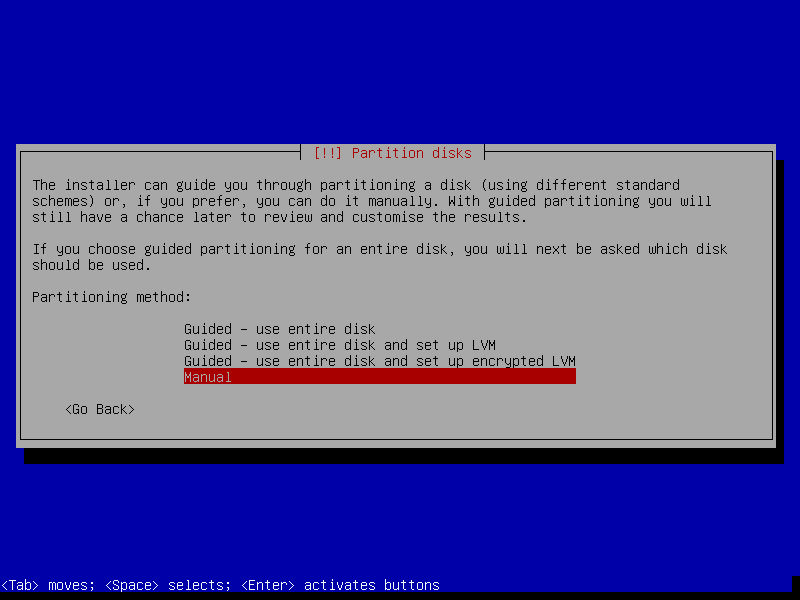

-   Create new partition table. (Default: [MBR][MBR])  
_**NOTE:** When your disk volume exceed 2 TB, you should choose [GPT][GPT] instead of default [MBR][MBR]_

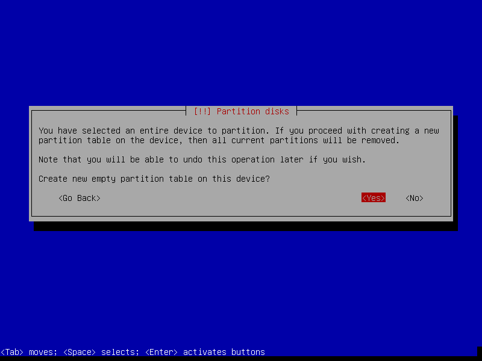

-   Select Free Space to create new partition. 

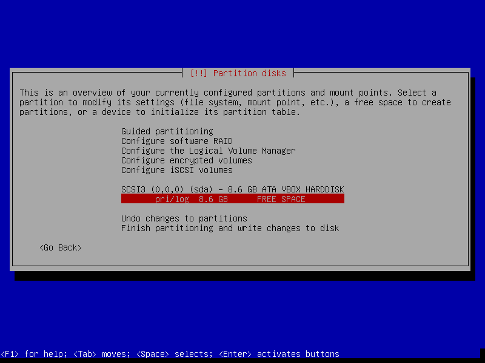

-   Setup size, type and location of new partition. Should create **/boot** first for setting bootloader.

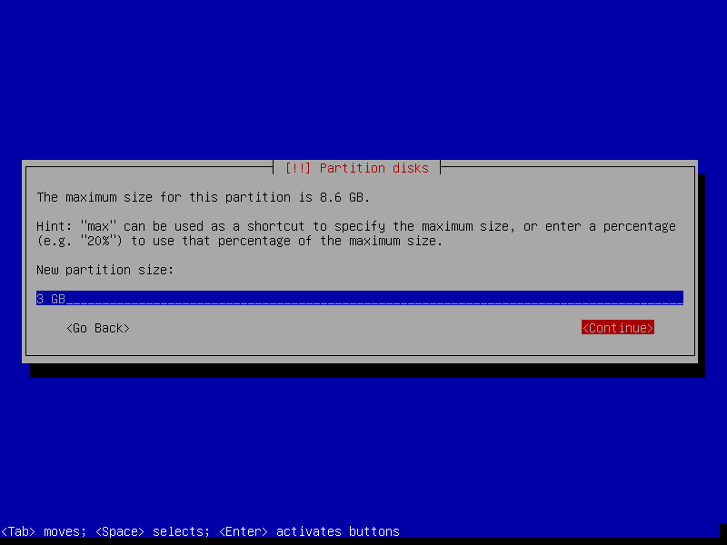

-   Turn on bootflag for **/boot** partition. Then write changes to disks.

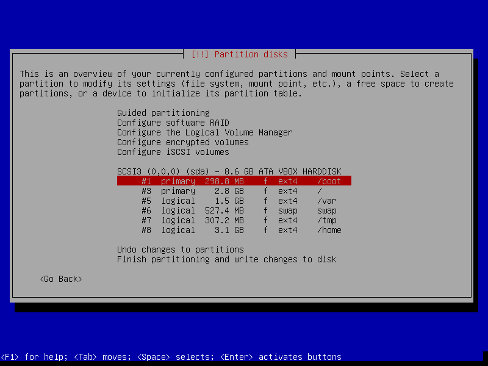

[MBR]: https://en.wikipedia.org/wiki/Master_boot_record
[GPT]: https://en.wikipedia.org/wiki/GUID_Partition_Table
[lvm]: install_lvm.md

### Skip the Configuration of Package Manager
A well developed **Package Manager** can be the soul of a linux distribution, 
bring much convenience to download open-source software in minimum typing 
strokes. However, we will config our package manager later.  
-   Skip scanning another CD/DVD and network installation.

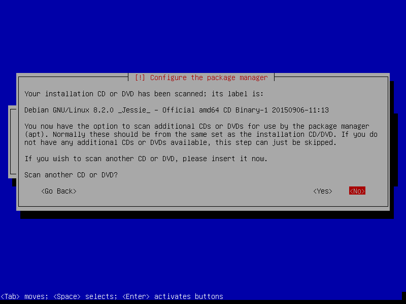

-   Decide participate Debian survey or not. (We choose no.)

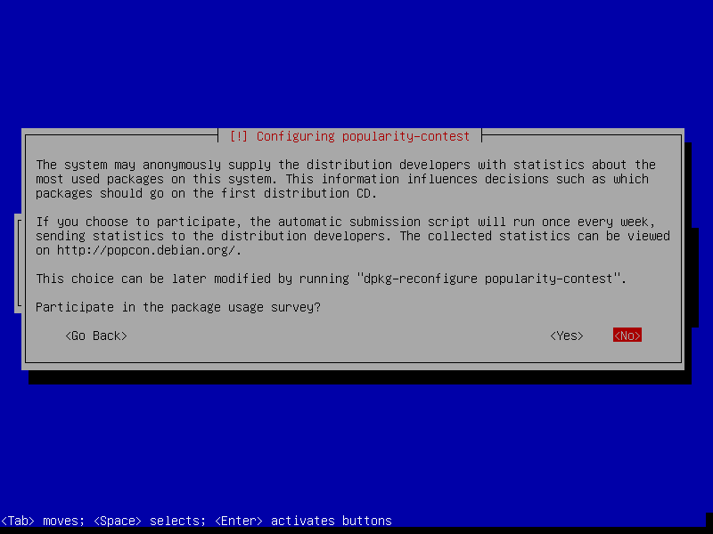

-   Select only **standard system utilties** to install.

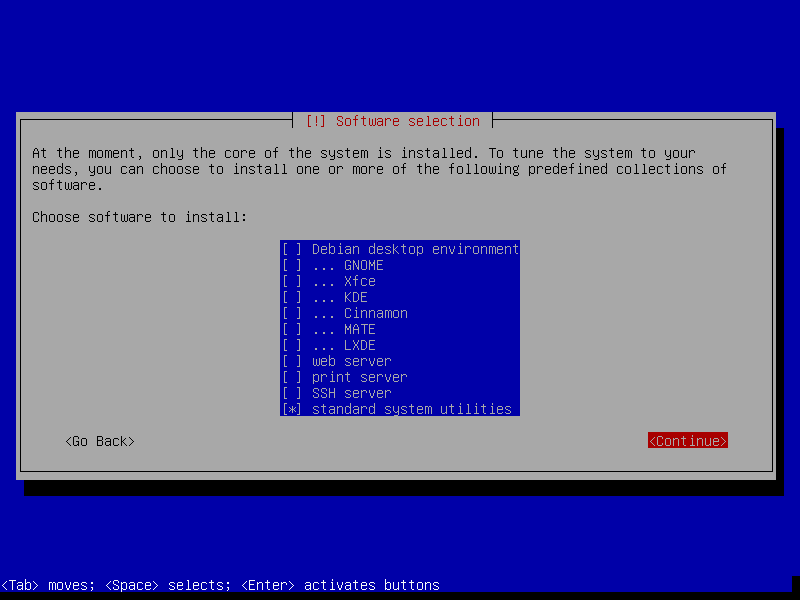

### Install the GRUB Boot Loader into MBR

By default, the amd64 boot loader **"grub"** will be installed into the Master 
Boot Record ([MBR][MBR]), where it will take over complete control of the boot 
process.  

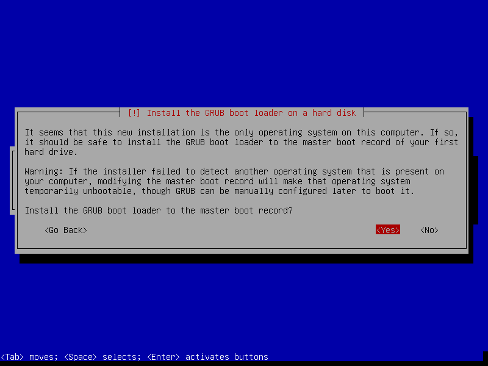

-   Select **Enter device manually**.

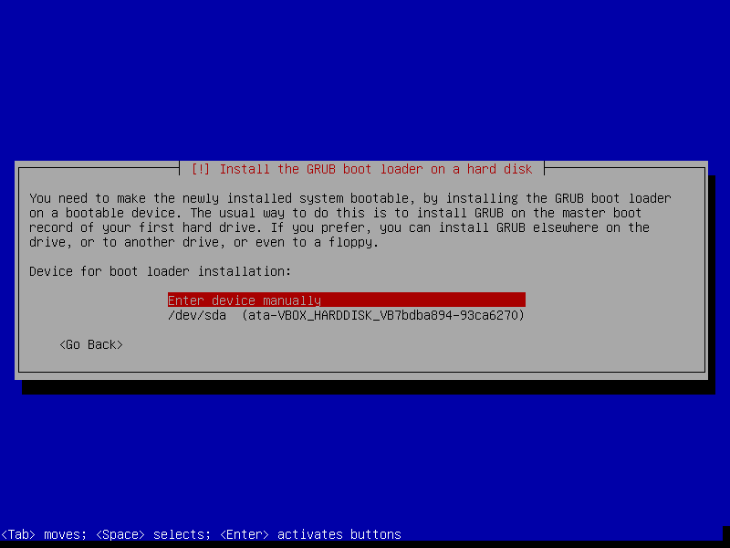

-   Decide where to install GRUB boot loader. (Generally, it depends on where your **/boot** partition located. In this manual, you should input **/dev/sda/**.)

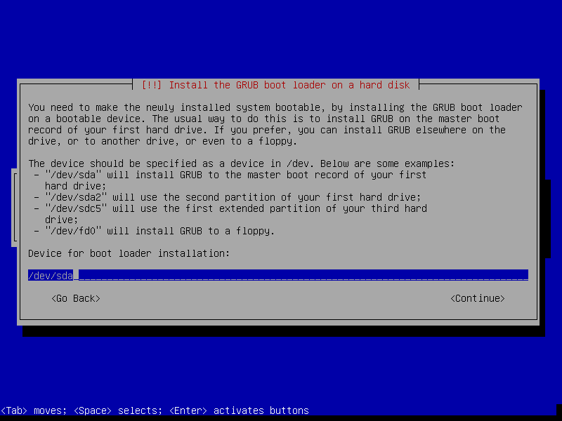

-   Finished the installation.

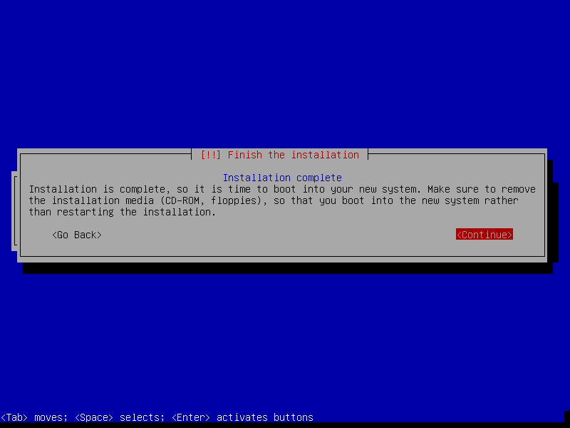

-   Congratulations! You've done the most difficult part of this manual. Let's startup the server.

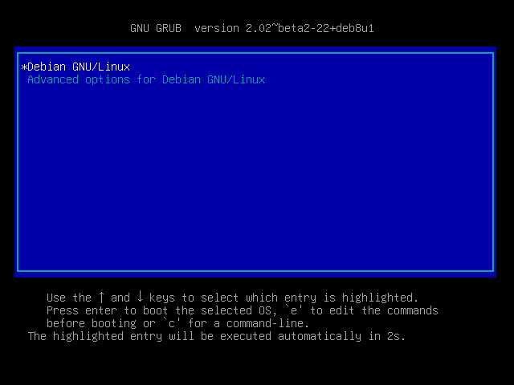
