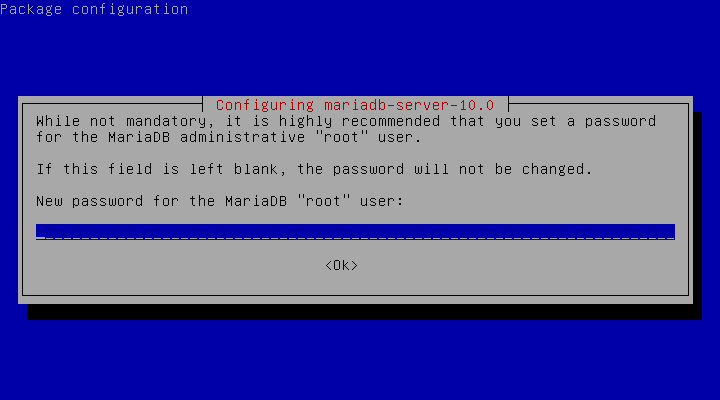

## MariaDB


MariaDB is one of the most popular database server in the world. Being a 
community-developed fork of MySQL RDBMS, MariaDB intended to remain free under 
the GNU GPL license.   

Why choose **MariaDB** over MySQL? You should see [this][choose-mariadb]!
[choose-mariadb]: https://seravo.fi/2015/10-reasons-to-migrate-to-mariadb-if-still-using-mysql


### Installation
First download MariaDB client and server
```bash
test@server$ sudo apt-get update
test@server$ sudo apt-get install mariadb-client mariadb-server
```

Then, set the password for root.


Finally, start MariaDB server
```bash
test@server$ sudo /etc/init.d/mysql start
```

### Simple Configuration
Simple commands for start/stop/restart server:
```bash
test@server$ sudo rstudio-server stop
test@server$ sudo rstudio-server start
test@server$ sudo rstudio-server restart
```

Mariadb setup initial databse in /var/lib/mysql by default. 
If you want to manually configure your installation, go to the secure installation:
```bash
test@server$ sudo mysql_secure_installation
```

If you have set a strong password, skip the first step.
```bash
NOTE: RUNNING ALL PARTS OF THIS SCRIPT IS RECOMMENDED FOR ALL MariaDB
      SERVERS IN PRODUCTION USE!  PLEASE READ EACH STEP CAREFULLY!

In order to log into MariaDB to secure it, we'll need the current
password for the root user.  If you've just installed MariaDB, and
you haven't set the root password yet, the password will be blank,
so you should just press enter here.

Enter current password for root (enter for none):


OK, successfully used password, moving on...

Setting the root password ensures that nobody can log into the MariaDB
root user without the proper authorisation.

You already have a root password set, so you can safely answer 'n'.

Change the root password? [Y/n]
```

Recommand to **remove anomyous users** for security.
```bash
By default, a MariaDB installation has an anonymous user, allowing anyone
to log into MariaDB without having to have a user account created for
them.  This is intended only for testing, and to make the installation
go a bit smoother.  You should remove them before moving into a
production environment.

Remove anonymous users? [Y/n]
```

For security issue, do not allow remote login for root.
```bash
Normally, root should only be allowed to connect from 'localhost'.  This
ensures that someone cannot guess at the root password from the network.

Disallow root login remotely? [Y/n]
```

Removing or not is all your choices.
```bash
By default, MariaDB comes with a database named 'test' that anyone can
access.  This is also intended only for testing, and should be removed
before moving into a production environment.

Remove test database and access to it? [Y/n]
```

Finally, flush all changes now.
```bash
Reloading the privilege tables will ensure that all changes made so far
will take effect immediately.

Reload privilege tables now? [Y/n]
```

### Change MariaDB Data Directory and Other Configurations
MariaDB save all databases in `/var/lib/mysql/` by default. If you aim to store Terabytes of data, your `/var` partition might get full.
To avoid this, you can modifiy some MariaDB variables.

First, stop MariaDB service.
```bash
test@server$ sudo service mysql stop 
```

Copy the existing data directory. Note that 
```bash
test@server$ sudo cp -R -p /var/lib/mysql /newpath/by/your-choice/
```

Edit the MariaDB configuration file
```bash
test@server$ sudo vim /etc/mysql/my.cnf
```

Look for the entry for **datadir** (usually under **[mysqld]**). Change the path (default: **/var/lib/mysql**) to your new data directory.
```
[mysqld]
...
...
other config
...

datadir = /newpath/by/your-choice
```


If you need to remotely connect to database, don't bind address. Comment out following line:  
```
#bind-address = 127.0.0.1
```

In addition, you can also change port for client under **[client]** group configuration. Default: 3306  
```
[client]
port = 13306
```

Moreover, you can separate some metadata file per table for convenience. Default: 0  
```
[mysqld]
...
...
...
other config
...

innodb_file_per_table = 1
```

After all the configurations, restart MariaDB server.
```bash
test@server$ sudo service mysql start
```


### Simple account management
MariaDB provide a command line tool. To enter your database on localhost, you must explicit input **user** and **password**.
```bash
test@server$ mysql -u root -p
```

If you succeed, you would see this:
```
MariaDB [(none)]> 
```

To create a super user that can remotely login, follow the commands in MariaDB shell:
```
MariaDB [(none)]> CREATE USER your_super_user@'%' IDENTIFIED BY 'your-Pa$$w0rD';
```

Then give all usage to the super user on all database (include create/drop other users)
```
MariaDB [(none)]> GRANT ALL PRIVILEGES ON *.* TO your_super_user@'%' with grant option; 
```

For more management of accounts and usages. Please read the [official documentation][grant].
[grant]: https://mariadb.com/kb/en/mariadb/grant/

### Database Management GUI Tools
Using GUI tools for daily database management will save your live from works.
Here are some recommandation:

[MySQL Workbench][workbench]: MySQL Official GUI Tools. Provides many advanced functions.  
[phpMyAdmin][phpmyadmin]: A Web interface tool written in PHP. Can I/O data to various formats (CSV, XML...).  
[HeidiSQL][heidisql]: A lightweith tool for database management. Has protable version. *Windows only*.  
[SQLyog Community Edition][sqlyog]: Community edition of SQLyog MySQL administration tool.  

[workbench]: http://www.mysql.com/products/workbench/
[phpmyadmin]: https://www.phpmyadmin.net/
[heidisql]: http://www.heidisql.com/
[sqlyog]: https://github.com/webyog/sqlyog-community/wiki/Downloads


### Database Interface for Other Language
Mariadb is under GPL license. Some other language need a less strict license version to connect to MariaDB server. 
Hence, install LGPL version library of client-side.
```bash
test@server$ sudo apt-get update
test@server$ sudo apt-get install libmariadb-client-lgpl-dev
```

With this library, you can user almost all SQL-like commands via popular languages such as R:
```r
if (!require(RMySQL)) install.package("RMySQL")
# Connect to a database
conn <- dbConnect(MySQL(), dbname = "test")
print(conn)
```

```
## <MySQLConnect:0,0>
```

Write data.frame into database. Then read it.
```r
dbWriteTable(conn, name = "mtcars", value = datasets::mtcars)

test_mtcars <- dbReadTable(conn, "mtcars")
dim(test_mtcars)
```

```
## [1] 32 11
```

SQL query statement
```r
res <- dbSendQuery(conn, "SELECT * FROM mtcars")
dbFetch(res, n = 3)
```

```
##       row_names  mpg cyl disp  hp drat    wt  qsec vs am gear carb
## 1     Mazda RX4 21.0   6  160 110 3.90 2.620 16.46  0  1    4    4
## 2 Mazda RX4 Wag 21.0   6  160 110 3.90 2.875 17.02  0  1    4    4
## 3    Datsun 710 22.8   4  108  93 3.85 2.320 18.61  1  1    4    1
```

```r
dbClearResult(res) # Clear the unused query results.
```

Remove table and disconnect 
```r
dbRemoveTable(conn, "mtcars")
dbDisconnect(conn)
```

If you are interesting in R and database. Do not miss [R DBI package on github](https://github.com/rstats-db/DBI).
